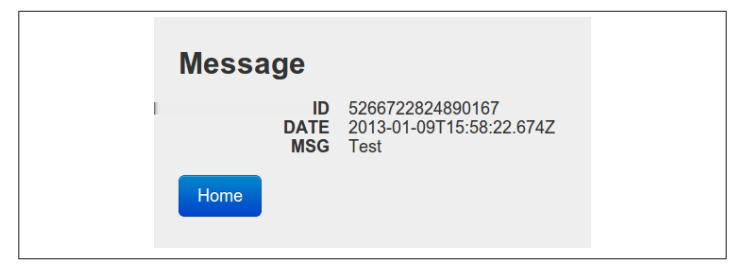

```
    </div>
  </body>
</html>
```

El navegador de Alice muestra este documento gráficamente (Figura 1-6) y, finalmente, regresa
a esperar la respuesta de Alice.




### Figura 1-6. Lo escribes... mensaje publicado

---

Estoy seguro de que te has encontrado con redireccionamientos HTTP antes, pero HTTP está lleno de pequeñas características como esta, y algunas pueden ser nuevas para ti. Hay muchas maneras en las que el servidor puede decirle al cliente que maneje una respuesta de manera diferente, y maneras para que el cliente actúe según condiciones o características extras en su solicitud. Un gran componente del diseño de API es el uso adecuado de estas características.

<span style="color:red">El Capítulo 11 </span> cubre las características de HTTP que son más importantes para trabajar con APIs, y los <span style="color:red">Apéndices A</span> y <span style="color:red">Apéndices B</span> proporcionan información complementaria sobre este tema.

---

Al observar la representación gráfica, Alice ve que su mensaje ("Test") es ahora una publicación completamente desarrollada en **YouTypeItWePostIt.com**. Aquí termina nuestra historia: Alice ha logrado su objetivo de probar la microblogging. Pero aún hay mucho que aprender de estas cuatro simples interacciones.

---

### Estado de la Aplicación

<span style="color:red">La Figura 1-7</span> es un diagrama de estado que muestra toda la aventura de Alice desde la perspectiva de su navegador web.
